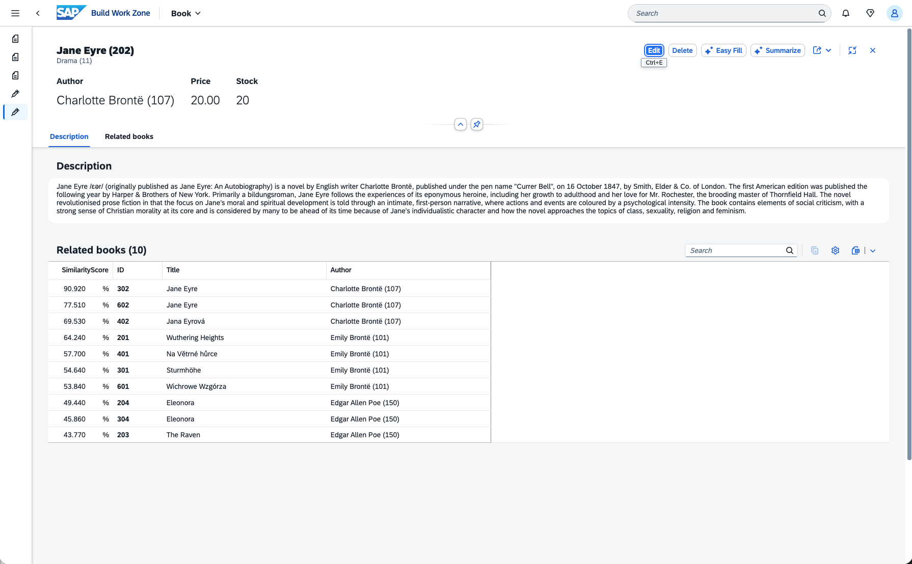

# SAP Cloud Application Programming Model, AI plugin for Node.js

The SAP Cloud Application Programming Model, AI plugin for Node.js bundles a variety of AI capabilities to infuse into your CAP applications:

> [!IMPORTANT]
> In multi tenancy scenarios with a sidecar the plugin must be included in the sidecar for SAP AI Core handling.

1. Recommendations
2. Simplified Embeddings
3. Simplified AI Core usage

## 1. Recommendations

Recommendations are implemented leveraging SAP-RPT-1 and AI Core. This plugin generically hooks into any entity which has a value help.

```cds 
entity Books {
  key ID : Integer;
  title  : String(111);
  descr  : String(1111);
  genre : Association to one Genres;
}
annotate Genres with @cds.odata.valuelist;
```


The genre field on the UI now automatically has recommendations. If you do not want recommendations for a specific field, it can be annotated with `@UI.RecommendationState`.

```cds
annotate Books with {
    genre @UI.RecommendationState : 0;
}
```

Dynamic expressions as values for `@UI.RecommendationState`, work as well!

```cds
annotate Books with {
    genre @UI.RecommendationState : (price > 200 ? 0 : 1);
}
```

## 2. Simplified embeddings

For natural language processing it is crucial to embed text data into a Vector. So far CAP only supported Vectors with HANA as a database.

To improve local development, this PoC adds support for SQLite to enable local development with embeddings. Furthermore compatibility for the following HANA Vector functions is added to SQLite:
- TO_REAL_VECTOR
- VECTOR_EMBEDDING
- CARDINALITY
- cosine_similarity
- l2distance

Vectors can be either manually created, like:

```cds
entity Books {
  key ID : Integer;
  title  : String(111);
  descr  : String(1111);
  embedding : Vector = (VECTOR_EMBEDDING(descr, 'DOCUMENT', 'amazon--titan-embed-text."1.2"')) stored;
}
```

where CAPs on-write calculated element is used to ensure a vector is generated every time the description is updated.

Alternatively the plugin also allows to use `@ai.embedding` and `@ai.embedding.@ai.model`. The default model used is 'SAP_GXY.20250407' but can be overridden via `cds.env.ai.embeddings.defaultModel`.

```cds
entity Books {
  key ID : Integer;
  title  : String(111);
  @ai.embedding
  descr  : String(1111);
}
```

```cds
entity Books {
  key ID : Integer;
  title  : String(111);
  @ai.embedding
  @ai.embedding.@ai.model : 'amazon--titan-embed-text."1.2"'
  descr  : String(1111);
}
```

HANA Cloud has native models for text embedding when their Natural Language Processing feature is enabled: `SAP_GXY.20250407` and `SAP_NEB.20240715`. However HANA Cloud can also be connected to AI Core via a remote source, and then embedding models from OpenAI and AWS can be used as well.

Because the remote source needs to be referenced within the `VECTOR_EMBEDDING` function, but the syntax is invalid within CAP, the plugin automatically adds the configured remote source, when the model is not from SAP. The default remote source is `AI_CORE` but it can be overridden via `cds.env.ai.embeddings.remoteSource`.

> [!WARNING]
> Currently only limited support exists for non SAP embedding models on HANA Cloud!
> The plugin does currently not create the remote source itself. Thus if non SAP embedding models shall be used, you need to create the remote source in HANA Cloud and grant the HDI RT user the reference privilege so it can use the remote source. Refer to the [documentation](https://help.sap.com/docs/hana-cloud-database/sap-hana-cloud-sap-hana-database-vector-engine-guide/creating-text-embeddings-with-sap-ai-core?locale=en-US).
> In Multi-Tenancy scenarios you would have to create a remote source per tenant and assign the reference privilege to the respective tenant binding. The remote source per tenant should be done because in AI Core each tenant should have a different resource group for isolation.

### SQLite Implementation

For SQLite the [fork](https://github.com/vlasky/sqlite-vec?tab=readme-ov-file) of [sqlite-vec](https://alexgarcia.xyz/sqlite-vec/api-reference.html#vec_f32) is used to support vectors within SQLite. Furthermore [synckit](https://github.com/un-ts/synckit) is being leveraged for calling AI Core within the 'VECTOR_EMBEDDING' function to generate vectors when an AI core model is specified. To mock SAP HANA embedding models the package [semantic-search](https://github.tools.sap/D065023/semantic-search/blob/main/README.md) from David Kunz is being leveraged.

<!-- ### Similar entities

When the entity is draft enabled and has any vector column, a similar entities table is automatically added. The score column is the average cosine similarity of every vector columns compared against the opened entity.

 -->

### Open Topics
- How to rotate the x.509 certificate from AI core?
- How to have multiple remote sources in HANA Cloud to have a unique resource group per tenant? Because AI core recommends that every tenant should have a unique resource group.
- How to more easily create remote sources. HDI containers do not have privileges for that and thus a [user provided service](https://community.sap.com/t5/technology-blog-posts-by-sap/step-by-step-guide-to-creating-remote-data-in-hdi/ba-p/13907315) is needed to grant the HDI container remote source access?

## 3. Simplified AI Core usage

The plugin introduces an `AICore` CAP service via which simplified AI Core access is possible.

```js
const aiCore = await cds.connect.to('AICore');
const {resourceGroups, deployments, configurations} = aiCore.entities;
const resourceGroups = await aiCore.run(SELECT.from(resourceGroups));
await aiCore.run(SELECT.from(resourceGroups).where({tenantId: cds.context.tenantId}));
await aiCore.run(SELECT.from(deployments).where({'resourceGroup.resourceGroupId': resourceGroups[0].resourceGroupId}));
await aiCore.run(SELECT.from(configurations).where({'resourceGroup.resourceGroupId': resourceGroups[0].resourceGroupId}));
```

Currently the following operations are supported:

| Operation | resourceGroups | deployments | configurations |
|-----------|---------------|-------------|----------------|
| **READ (list)** | ✓ | ✓ | ✓ |
| - limit | ✓ | ✓ | ✓ |
| - where* | `tenantId`, `resourceGroupId` | `resourceGroup.resourceGroupId` | `resourceGroup.resourceGroupId` |
| - search | - | - | ✓ |
| **READ (single)** | ✓ | ✓ | ✓ |
| **CREATE** | ✓ | ✓ | - |
| **UPDATE** | ✓ | ✓ | - |
| - where* | `tenantId`, `resourceGroupId` | `id`, `resourceGroup.resourceGroupId` | - |
| **UPSERT** | ✓ | ✓ | - |
| - where* | - | `id`, `resourceGroup.resourceGroupId` | - |
| **DELETE** | ✓ | - | - |

\* Only simple equality checks against the listed properties are supported

<!-- TODO:
- Predictive API wrapper
- Simplified versioning -->