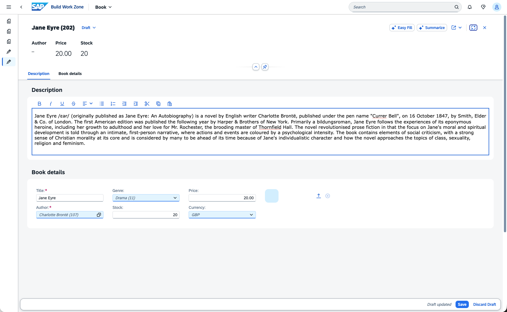
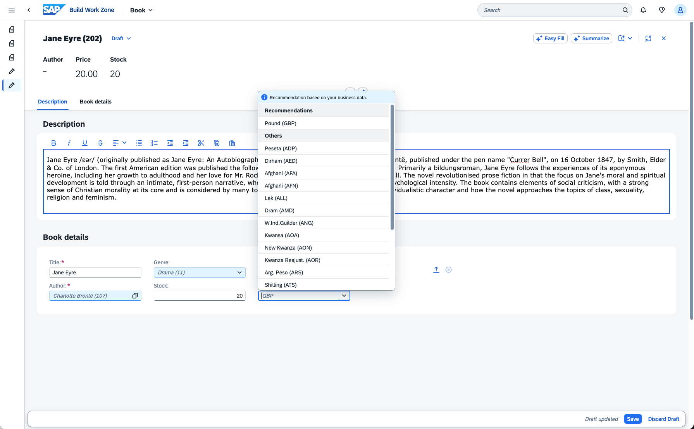
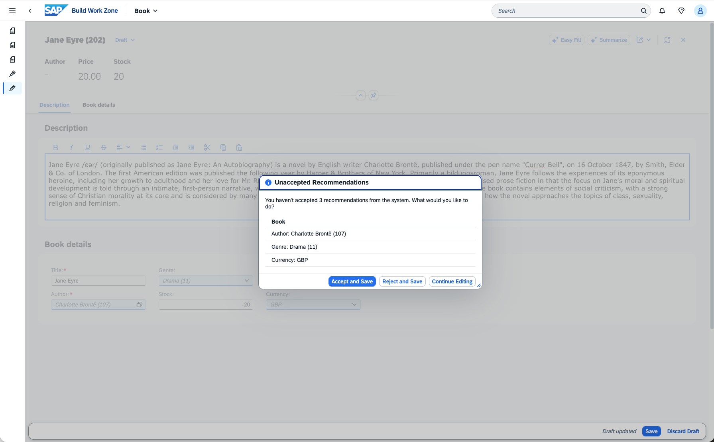

[](https://api.reuse.software/info/github.com/cap-js/ai)

# SAP Cloud Application Programming Model, AI plugin for Node.js

## About this project

The SAP Cloud Application Programming Model, AI plugin for Node.js bundles two AI capabilities to infuse into your CAP applications:
1. UI Recommendations
2. Simplified AI Core usage

> [!IMPORTANT]
> In multi tenancy scenarios with a sidecar the plugin must be included in the sidecar for SAP AI Core handling.

### 1. Use case: Recommendations

Recommendations are implemented leveraging SAP-RPT-1 and AI Core. This plugin generically hooks into any entity which has properties with a value help (detected via `@Common.ValueList` on the property or `@cds.odata.valuelist` on the association target).

```cds 
entity Books {
  key ID : Integer;
  title  : String(111);
  descr  : String(1111);
  genre : Association to one Genres;
  status : Association to one Status;
}
annotate Genres with @cds.odata.valuelist;
annotate Books with {
    status @Common.ValueList : {
        CollectionPath : 'Status',
        Parameters: [
            {
                $Type: 'Common.ValueListParameterInOut'
                ValueListProperty : 'code',
                LocalDataProperty : status_code
            }
        ]
    }
}
```





The genre field on the UI now automatically has recommendations. If you do not want recommendations for a specific field, it can be annotated with `@UI.RecommendationState`.

```cds
annotate Books with {
    genre @UI.RecommendationState : 0;
}
```

Dynamic expressions as values for `@UI.RecommendationState`, work as well!

```cds
annotate Books with {
    genre @UI.RecommendationState : (price > 200 ? 0 : 1);
}
```

### 2. Use case: Simplified AI Core usage

The plugin introduces an `AICore` CAP service that automatically performs some administrative tasks and offers simplified access to AI Core.

#### Automatic operations

- The plugin automatically creates a new SAP AI Core resource group per tenant during tenant onboarding and deletes it during offboarding.
- The plugin automatically creates an RPT-1 deployment per resource group for the recommendations feature.

#### Simplified AI Core API access

```js
const aiCore = await cds.connect.to('AICore');
const {resourceGroups, deployments, configurations} = aiCore.entities;
await aiCore.run(SELECT.from(resourceGroups));
await aiCore.run(SELECT.from(resourceGroups).where({tenantId: cds.context.tenant}));
await aiCore.run(SELECT.from(deployments).where({'resourceGroup.resourceGroupId': resourceGroups[0].resourceGroupId}));
await aiCore.run(SELECT.from(configurations).where({'resourceGroup.resourceGroupId': resourceGroups[0].resourceGroupId}));
```

Currently, the following `cds.ql` operations are supported:

| Operation | resourceGroups | deployments | configurations |
|-----------|---------------|-------------|----------------|
| **READ (list)** | ✓ | ✓ | ✓ |
| - limit | ✓ | ✓ | ✓ |
| - where* | `tenantId`, `resourceGroupId` | `resourceGroup.resourceGroupId` | `resourceGroup.resourceGroupId` |
| - search | - | - | ✓ |
| **READ (single)** | ✓ | ✓ | ✓ |
| **CREATE** | ✓ | ✓ | ✓ |
| **UPDATE** | ✓ | ✓ | - |
| - where* | `tenantId`, `resourceGroupId` | `id`, `resourceGroup.resourceGroupId` | - |
| **UPSERT** | ✓ | ✓ | - |
| - where* | - | `id`, `resourceGroup.resourceGroupId` | - |
| **DELETE** | ✓ | ✓ | - |
| - where* | `tenantId`, `resourceGroupId` | `id`, `resourceGroup.resourceGroupId` | - |

\* Only simple equality checks against the listed properties are supported

Next to CRUD operations the following helper functions can be used:

```js
const aiCore = await cds.connect.to('AICore');
const {resourceGroups, deployments, configurations} = aiCore.entities;

// Fetch a resource group for a CDS tenant ID
const resourceGroupId = await aiCore.resourceGroupForTenant(cds.context.tenant)

// Call the RPT-1 API to fetch predictions - see AICoreService.cds for the schema
const predictions = await aiCore.predictRowColumns(/** RPT-1 payload */)

/**
 * Returns the deployment ID for RPT-1. If no RPT-1 deployment exists, creates one for the
 * resource group
*/
const rpt1DeploymentId = await aiCore.rpt1DeploymentId(resourceGroups, {resourceGroupId})

// Stops an AI Core deployment
await aiCore.stop(deployments, {id: '<deployment id>'})
```

## Requirements and Setup

To use the plugin in production scenarios you need an [SAP AI Core](https://help.sap.com/docs/sap-ai-core) service binding. The plugin will automatically create resource groups per tenant in multi-tenancy scenarios and create an RPT-1 deployment in each for the recommendations feature. In single-tenant setups the plugin uses the 'default' resource group and creates an RPT-1 deployment as well if none exists.

For single-tenant deployments you can change the resource group as follows:

```json
{
    "cds": {
        "requires": {
            "AICore": {
                "resourceGroup": "CUSTOM_SINGLE_TENANT_RESOURCE_GROUP"
            }
        }
    }
}
```

For Cloud Foundry apps an example config could look like this:

```yaml
modules:
  - name: incidents-srv
    type: nodejs
    path: gen/srv
    requires:
      - name: incidents-ai-core
resources:
  - name: incidents-ai-core
    type: org.cloudfoundry.managed-service
```


## Test the plugin locally

In `tests/bookshop-app/` you can find a sample application that is used to demonstrate how to use the plugin and to run tests against it.

### Local Testing

To execute local tests, simply run:

```bash
npm run test
```

For tests, the `cds-test` Plugin is used to spin up the application. More information about `cds-test` can be found [here](https://cap.cloud.sap/docs/node.js/cds-test).

For integration tests you need an AI Core binding.

```bash
cds bind ai-core -2 <your-ai-core-service-instance>
npm run test:hybrid
```

## Support, Feedback, Contributing

This project is open to feature requests/suggestions, bug reports etc. via [GitHub issues](https://github.com/cap-js/ai/issues). Contribution and feedback are encouraged and always welcome. For more information about how to contribute, the project structure, as well as additional contribution information, see our [Contribution Guidelines](CONTRIBUTING.md).

## Security / Disclosure

If you find any bug that may be a security problem, please follow our instructions [in our security policy](https://github.com/cap-js/ai/security/policy) on how to report it. Please do not create GitHub issues for security-related doubts or problems.

## Code of Conduct

We as members, contributors, and leaders pledge to make participation in our community a harassment-free experience for everyone. By participating in this project, you agree to abide by its [Code of Conduct](https://github.com/cap-js/.github/blob/main/CODE_OF_CONDUCT.md) at all times.

## Licensing

Copyright 2026 SAP SE or an SAP affiliate company and ai contributors. Please see our [LICENSE](LICENSE) for copyright and license information. Detailed information including third-party components and their licensing/copyright information is available [via the REUSE tool](https://api.reuse.software/info/github.com/cap-js/ai).
