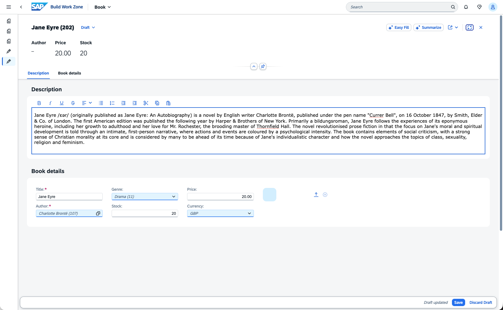

[](https://api.reuse.software/info/github.com/cap-js/ai)

# CAP AI plugin for Node.js

`@cap-js/ai` adds UI recommendations powered by SAP AI Core, simplified access to SAP AI Core resources, and vector embedding support for CAP applications.

## Recommendations

The plugin adds SAP-RPT-1 recommendations to draft-enabled entities. Fields with a value help are included automatically:

```cds
@odata.draft.enabled
entity Books {
  key ID    : Integer;
      title : String;
      genre : Association to Genres;
      price : Decimal;
}

annotate Genres with @cds.odata.valuelist;
```



Use `@UI.RecommendationState` to opt individual fields in or out:

```cds
annotate Books with {
  genre @UI.RecommendationState: 0;
  price @UI.RecommendationState;
}
```

A production deployment requires an [SAP AI Core](https://help.sap.com/docs/sap-ai-core) service binding. Without one, local development uses a mock implementation for UI smoke tests. See [Recommendations](.docs/recommendations.md) for regression targets, request behavior, data handling, and deployment lifecycle.

## SAP AI Core

The plugin provides an `AICore` CAP service for managing resource groups, deployments, and configurations:

```js
const aiCore = await cds.connect.to('AICore');
const { resourceGroups, deployments } = aiCore.entities;

const groups = await aiCore.run(SELECT.from(resourceGroups));
await aiCore.stop(deployments, { id: '<deployment id>' });
```

See [SAP AI Core integration](.docs/ai-core.md) for setup, supported queries, helper methods, and multitenancy.

## Local vector embeddings with SQLite (experimental)

> [!WARNING]
> The SQLite extensions, local vector embeddings, local model management, and the related tooling are experimental facilities for local development. Breaking changes are expected, including changes caused by SQLite's synchronous function interface and by local model management. Use SAP HANA's vector engine for production vector workloads.

`@cap-js/ai` redirects the standard `sqlite` database so that `VECTOR_EMBEDDING` and the vector functions run locally against a real [ONNX](https://onnx.ai) model — no external service, and no code changes versus SAP HANA. This lets you develop and test semantic search on SQLite. The following searches [Bookshop](https://github.com/capire/bookshop)'s books by the meaning of their descriptions.

1. Install the local-development dependencies:

   ```sh
   npm add -D @cap-js/ai @cap-js/sqlite@^3.1 @huggingface/hub@^2.15.0 \
     @huggingface/tokenizers@0.1.3 onnxruntime-node@1.20.1
   ```

   This requires `@sap/cds` `^10.1` and `@cap-js/sqlite` `^3.1` (the package's other capabilities still support `@sap/cds` 9). No configuration is needed: the standard `sqlite` and `sqlite:memory` databases pick up the local implementation automatically.

2. Store an embedding of each book's description. Extend `Books` with a calculated element that is computed on write:

   ```cds
   using { sap.capire.bookshop.Books } from '@capire/bookshop';

   extend Books with {
     embedding : Vector = vector_embedding(descr, 'DOCUMENT', 'SAP_GXY.20250407') stored;
   }
   ```

   The model name is ignored on SQLite — the locally configured model is used — and honored on SAP HANA, so the same definition runs unchanged on both.

3. Expose the search as an OData function that ranks book descriptions by cosine similarity to an embedded search phrase:

   ```cds
   using { sap.capire.bookshop.Books } from '@capire/bookshop';

   service SearchService {
     function searchBooks(phrase : String) returns array of {
       title : String;
       relevance : Double;
     };
   }
   ```

   ```js
   const cds = require('@sap/cds')

   module.exports = class SearchService extends cds.ApplicationService { init() {
     this.on('searchBooks', ({ data: { phrase } }) =>
       SELECT.from('sap.capire.bookshop.Books')
         .columns`title, cosine_similarity(embedding,
           vector_embedding(${phrase}, 'QUERY', 'SAP_GXY.20250407')) as relevance`
         .orderBy`relevance desc`
     )
     return super.init()
   }}
   ```

4. Run the app and call the function:

   ```sh
   cds watch
   ```

   In another terminal:

   ```sh
   curl "http://localhost:4004/odata/v4/search/searchBooks(phrase='a%20haunting%20poem%20about%20lost%20love')"
   ```

On the first start, `@cap-js/ai` warns that the default model is missing, downloads it to `.cds/models`, and initializes it; later starts reuse it. Embeddings are returned as a JSON-encoded vector.

The current default is [`sentence-transformers/all-MiniLM-L6-v2`](https://huggingface.co/sentence-transformers/all-MiniLM-L6-v2), chosen only as the most-downloaded reasonably small model matching the sentence-similarity task, ONNX format, and Apache-2.0 license. This is not a recommendation and may change while the feature is experimental — set `cds.requires.db.embedding.model` to pin it. Browse alternatives among [trending Apache-2.0 sentence-similarity models with ONNX artifacts](https://huggingface.co/models?pipeline_tag=sentence-similarity&library=onnx&license=license:apache-2.0&sort=trending), then validate your choice with the provided tooling.

See [Choosing a model](.docs/model-selection.md) and [Local vector embeddings](.docs/vector-embeddings.md) for compatibility checks, explicit or shared provisioning, runtime behavior, and limitations.

## Advanced

- [Recommendations](.docs/recommendations.md) — generated service shape, prediction context, regression targets, and lifecycle
- [SAP AI Core integration](.docs/ai-core.md) — bindings, multitenancy, supported operations, and helper methods
- [Local vector embeddings](.docs/vector-embeddings.md) — SQLite kinds, model provisioning, SQL function behavior, and trust boundaries
- [Choosing a model](.docs/model-selection.md) — Hugging Face filters, compatibility requirements, and size tradeoffs
- [Local knowledge graph](.docs/knowledge-graph.md) — experimental `SPARQL_EXECUTE` and `sparql_table` support

## Test the plugin locally

The sample application is in `tests/bookshop`.

```sh
npm test
```

Integration tests require an SAP AI Core binding:

```sh
cds bind ai-core -2 <your-ai-core-service-instance>
npm run test:hybrid
```

## Support, feedback, and contributing

This project welcomes feature requests, bug reports, and contributions through [GitHub issues](https://github.com/cap-js/ai/issues). See the [Contribution Guidelines](CONTRIBUTING.md) for development information.

## Security

Report potential security issues through the project's [security policy](https://github.com/cap-js/ai/security/policy), not through public issues.

## Code of Conduct

Participation in this project is governed by the [Code of Conduct](https://github.com/cap-js/.github/blob/main/CODE_OF_CONDUCT.md).

## Licensing

Copyright 2026 SAP SE or an SAP affiliate company and ai contributors. See [LICENSE](LICENSE) and the [REUSE report](https://api.reuse.software/info/github.com/cap-js/ai).
