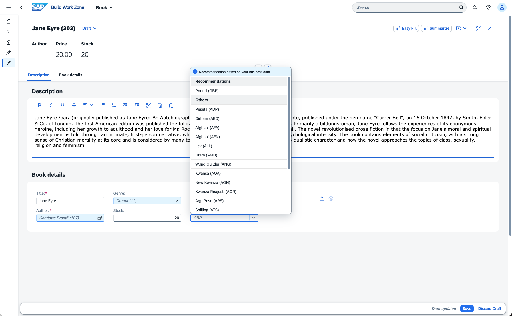
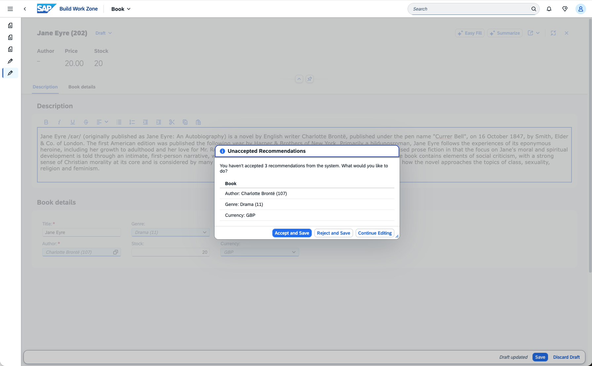

[](https://api.reuse.software/info/github.com/cap-js/ai)

# SAP Cloud Application Programming Model, AI plugin for Node.js

## About this project

The SAP Cloud Application Programming Model, AI plugin for Node.js bundles two AI capabilities to infuse into your CAP applications:
1. UI Recommendations
2. Simplified AI Core usage

> [!IMPORTANT]
> In multi tenancy scenarios with a sidecar the plugin must be included in the sidecar for SAP AI Core handling.

### 1. Use case: Recommendations

Recommendations are implemented leveraging [SAP-RPT-1](https://help.sap.com/docs/sap-ai-core/generative-ai/sap-rpt-1) and AI Core. This plugin generically hooks into any entity which has properties with a value help (detected via `@Common.ValueList` on the property or `@cds.odata.valuelist` on the association target).

```cds 
entity Books {
  key ID : Integer;
  title  : String(111);
  descr  : String(1111);
  genre : Association to one Genres;
  status : Association to one Status;
}
annotate Genres with @cds.odata.valuelist;
annotate Books with {
    status @Common.ValueList : {
        CollectionPath : 'Status',
        Parameters: [
            {
                $Type: 'Common.ValueListParameterInOut'
                ValueListProperty : 'code',
                LocalDataProperty : status_code
            }
        ]
    }
}
```





The genre field on the UI now automatically has recommendations. If you do not want recommendations for a specific field, it can be annotated with `@UI.RecommendationState`.

```cds
annotate Books with {
    genre @UI.RecommendationState : 0;
}
```

Dynamic expressions as values for `@UI.RecommendationState`, work as well!

```cds
annotate Books with {
    genre @UI.RecommendationState : (price > 200 ? 0 : 1);
}
```

#### Regression Recommendations on fields without a value help

By default, the plugin only enhances fields that have a value help list since these columns are good prediction targets for classification. However, some fields are good targets but have no value list: free-form numerics like measurement ranges, calibration values, or planning estimates. Annotate these with `@UI.RecommendationState` to opt in:

```cds
entity CalibrationData : cuid {
  measuringRangeMin : Decimal(16, 6) @UI.RecommendationState;
  measuringRangeMax : Decimal(16, 6) @UI.RecommendationState;
  operatingPoint    : Decimal(16, 6) @UI.RecommendationState;
  description       : String         @UI.RecommendationState;
}
```

The annotation only takes effect on **scalar** elements (no associations / compositions / unmanaged elements; for those, attach a value help instead). Annotated fields are added to the entity's `<Entity>_Recommendations` companion just like value-helped fields, and Fiori Elements' soft-fill placeholder renders the prediction in the empty input.

`task_type` is chosen automatically per column:
- numeric scalar (`Integer*`, `Decimal`, `Double`) annotated with `@UI.RecommendationState` → **`regression`** so RPT-1 can interpolate continuous values,
- everything else → **`classification`**.

> [!NOTE]
> Numeric fields that have a value help (e.g. a fixed price-point list) stay on classification — `@UI.RecommendationState` is only needed when there is *no* value help. Combining both is unnecessary.

> [!WARNING]
> SAP Fiori Elements does not yet support rendering recommendations for scalar fields without a value help. The backend correctly provides predictions for these fields, but the Fiori Elements client currently only requests and displays recommendations for fields annotated with `@Common.ValueList` or `@Common.ValueListWithFixedValues`.

<details>
<summary><b>How recommendations work under the hood</b></summary>

A short FAQ for integrators, so you don't have to read the source.


**What does the plugin emit on the OData service?**
On every draft-enabled entity that has at least one value-helped field, it adds an entity-level annotation `@UI.Recommendations: { '=': 'SAP_Recommendations' }` plus a synthetic companion entity (`<Entity>_Recommendations`, `@cds.persistence.skip`) with one virtual array per recommendable field. Each item carries `RecommendedFieldValue`, `RecommendedFieldDescription`, `RecommendedFieldScoreValue` and `RecommendedFieldIsSuggestion` — the shape Fiori Elements expects for `UI.RecommendationListType`. The first entry per field has `RecommendedFieldIsSuggestion: true` and is rendered as the soft-fill default.

**When does it run?**
On READ requests to a draft entity that expand `SAP_Recommendations`. Reads against the active entity return nothing in that field. Reads during `draftActivate` are skipped.

**What data is sent to RPT-1 as context?**
Up to 2000 rows from the **active** version of the same entity, restricted to rows where every recommendable field is non-null. The columns `createdAt`, `createdBy`, `modifiedAt`, `modifiedBy` plus any `cds.LargeBinary` / `cds.Vector` elements are stripped. The active row corresponding to the draft (if any) is removed and replaced by the draft row carrying `[PREDICT]` placeholders in the columns to predict. There is no sampling or `ORDER BY` — for tables larger than 2000 rows, which rows make the cut is determined by the database.

> [!IMPORTANT]
> Everything in the remaining columns is forwarded to AI Core. Annotate sensitive fields with `@UI.RecommendationState : 0` (or a dynamic expression) to keep them out of both the predictions and the context payload.

**How are descriptions populated?**
For each predicted value, the plugin issues an extra SELECT against the field's `@Common.Text` association (if set) to fetch the human-readable label. Fields without `@Common.Text` get an empty `RecommendedFieldDescription`.

**RPT-1 deployment lifecycle**
First prediction call against a resource group provisions an `sap-rpt-1-small` deployment in scenario `foundation-models` (executable `aicore-sap`) and polls up to 10× with exponential backoff until it reaches `RUNNING`. Subsequent calls reuse the cached deployment. Single-tenant uses the configured `resourceGroup` (default `'default'`); multi-tenant creates one resource group per tenant on subscribe (label `ext.ai.sap.com/CDS_TENANT_ID`) and deletes it on unsubscribe.

**Local development**
Without an AI Core binding the plugin uses `MockAICoreService`, which returns the first non-null value of each target column from the context as the "prediction" — useful for UI smoke tests, useless as a quality signal. Run `cds bind <your-aicore-instance>` and start with profile `hybrid` to talk to a real AI Core deployment locally.

</details>

### 2. Use case: Simplified AI Core usage

The plugin introduces an `AICore` CAP service that automatically performs some administrative tasks and offers simplified access to AI Core.

#### Automatic operations

- The plugin automatically creates a new SAP AI Core resource group per tenant during tenant onboarding and deletes it during offboarding.
- The plugin automatically creates an RPT-1 deployment per resource group for the recommendations feature.

#### Simplified AI Core API access

```js
const aiCore = await cds.connect.to('AICore');
const {resourceGroups, deployments, configurations} = aiCore.entities;
await aiCore.run(SELECT.from(resourceGroups));
await aiCore.run(SELECT.from(resourceGroups).where({tenantId: cds.context.tenant}));
await aiCore.run(SELECT.from(deployments).where({'resourceGroup.resourceGroupId': resourceGroups[0].resourceGroupId}));
await aiCore.run(SELECT.from(configurations).where({'resourceGroup.resourceGroupId': resourceGroups[0].resourceGroupId}));
```

Currently, the following `cds.ql` operations are supported:

| Operation | resourceGroups | deployments | configurations |
|-----------|---------------|-------------|----------------|
| **READ (list)** | ✓ | ✓ | ✓ |
| - limit | ✓ | ✓ | ✓ |
| - where* | `tenantId`, `resourceGroupId` | `resourceGroup.resourceGroupId` | `resourceGroup.resourceGroupId` |
| - search | - | - | ✓ |
| **READ (single)** | ✓ | ✓ | ✓ |
| **CREATE** | ✓ | ✓ | ✓ |
| **UPDATE** | ✓ | ✓ | - |
| - where* | `tenantId`, `resourceGroupId` | `id`, `resourceGroup.resourceGroupId` | - |
| **UPSERT** | ✓ | ✓ | - |
| - where* | - | `id`, `resourceGroup.resourceGroupId` | - |
| **DELETE** | ✓ | ✓ | - |
| - where* | `tenantId`, `resourceGroupId` | `id`, `resourceGroup.resourceGroupId` | - |

\* Only simple equality checks against the listed properties are supported

Next to CRUD operations the following helper functions can be used:

```js
const aiCore = await cds.connect.to('AICore');
const {resourceGroups, deployments, configurations} = aiCore.entities;

// Fetch a resource group for a CDS tenant ID
const resourceGroupId = await aiCore.resourceGroupForTenant(cds.context.tenant)

// Call the RPT-1 API to fetch predictions - see AICoreService.cds for the schema
const predictions = await aiCore.predictRowColumns(/** RPT-1 payload */)

/**
 * Returns the deployment ID for RPT-1. If no RPT-1 deployment exists, creates one for the
 * resource group
*/
const rpt1DeploymentId = await aiCore.rpt1DeploymentId(resourceGroups, {resourceGroupId})

// Stops an AI Core deployment
await aiCore.stop(deployments, {id: '<deployment id>'})
```

## Requirements and Setup

To use the plugin in production scenarios you need an [SAP AI Core](https://help.sap.com/docs/sap-ai-core) service binding. The plugin will automatically create resource groups per tenant in multi-tenancy scenarios and create an RPT-1 deployment in each for the recommendations feature. In single-tenant setups the plugin uses the 'default' resource group and creates an RPT-1 deployment as well if none exists.

For single-tenant deployments you can change the resource group as follows:

```json
{
    "cds": {
        "requires": {
            "AICore": {
                "resourceGroup": "CUSTOM_SINGLE_TENANT_RESOURCE_GROUP"
            }
        }
    }
}
```

For Cloud Foundry apps an example config could look like this:

```yaml
modules:
  - name: incidents-srv
    type: nodejs
    path: gen/srv
    requires:
      - name: incidents-ai-core
resources:
  - name: incidents-ai-core
    type: org.cloudfoundry.managed-service
```

### 3. Local Vector Embeddings with SQLite

The `ai-sqlite` database kind extends `@cap-js/sqlite` with local semantic embeddings using an ONNX encoder model. Configure the model explicitly for every service.

#### Usage

Install the optional runtime dependencies:

```sh
npm add @cap-js/sqlite onnxruntime-node@1.20.1
```

`ai-sqlite` currently requires exactly `onnxruntime-node` 1.20.1 because synchronous SQLite functions need a version-specific native runtime API.

#### Model provisioning

Runtime configuration is intentionally limited to a model name and an optional directory:

```json
{
  "cds": {
    "requires": {
      "db": {
        "kind": "ai-sqlite",
        "embedding": {
          "model": "Xenova/all-MiniLM-L6-v2"
        }
      }
    }
  }
}
```

`embedding` and its `model` are required. If `cds.env.requires.db.embedding.model` is absent, `ai-sqlite` fails during startup. `directory` is optional. No revision, dimensions, tokenizer, file, pooling, or checksum settings are accepted in runtime configuration.

The provisioning approaches are:

| Approach | `embedding` configuration | Startup behavior |
| --- | --- | --- |
| Ad-hoc download | `{ "model": "Xenova/all-MiniLM-L6-v2" }` | Checks the automatically determined cache directory. If the model is missing or invalid, logs a warning, provisions a verified copy, and reuses it on subsequent starts. |
| Pre-installed automatic cache | Same model-only configuration as ad-hoc download | Finds the model in the automatically determined cache directory; no startup download is needed. |
| Pre-installed configured directory | `{ "model": "...", "directory": "..." }` | Reads and verifies the provisioned directory. Startup never downloads into or modifies it. |

##### Ad-hoc download

Ad-hoc download is available for built-in model presets. With no `directory`, the model name selects the preset and automatically determines:

- the immutable model revision and verified artifact set
- embedding dimensions, tokenizer input limit, pooling, and normalization
- the automatically determined cache directory

If the verified files are absent or fail their integrity checks, startup prints a warning and attempts to provision a verified copy. Concurrent processes using the same cold cache wait for the first download and then reuse it. A conflicting or malformed lock is never silently replaced.

The cache root is selected from `CDS_AI_MODEL_CACHE` when set. Otherwise it uses `XDG_DATA_HOME/semantic-search/models` or `~/.local/share/semantic-search/models` on POSIX systems, and `LOCALAPPDATA/semantic-search/models`, `APPDATA/semantic-search/models`, or `~/AppData/Local/semantic-search/models` on Windows. The model-specific subdirectory is derived from its repository, revision, and artifact set.

##### Pre-installed in the automatic cache

To avoid a runtime download while retaining model-only configuration, install the model before starting or deploying the application:

```sh
npx cds-ai model install Xenova/all-MiniLM-L6-v2
```

The command uses the same automatically determined cache directory as the runtime, verifies artifact sizes and SHA-256 checksums, and writes an `embedding.lock.json`. The application configuration remains:

```json
{
  "embedding": {
    "model": "Xenova/all-MiniLM-L6-v2"
  }
}
```

Use the same `CDS_AI_MODEL_CACHE` value during installation and at runtime when selecting another cache root.

##### Pre-installed in a configured directory

An explicit directory is suitable for application images, read-only mounts, or a model shared by multiple applications:

```sh
npx cds-ai model install Xenova/all-MiniLM-L6-v2 --directory ./models/minilm
```

```json
{
  "embedding": {
    "model": "Xenova/all-MiniLM-L6-v2",
    "directory": "./models/minilm"
  }
}
```

The CLI resolves a relative `--directory` from its working directory. Runtime configuration resolves a relative `embedding.directory` from `cds.root`; absolute directories are used unchanged in both cases. Run the install command from `cds.root` or use the same absolute path so both refer to the same model directory.

A configured directory must already contain a valid `embedding.lock.json` and all verified artifacts. Startup remains offline and fails rather than downloading if the directory is incomplete. `CDS_AI_MODEL_CACHE` has no effect when `embedding.directory` is configured.

##### Automatic model metadata detection

The runtime obtains technical model configuration without exposing it through `cds.requires.db.embedding`:

- Without `directory`, the model name resolves to a built-in preset containing the pinned revision, artifacts, checksums, dimensions, tokenizer limit, and output semantics.
- With `directory`, the runtime reads those values from `embedding.lock.json`, verifies the artifacts, and checks that its repository matches `embedding.model`. Built-in presets are additionally checked against their complete pinned descriptor.

This is not dynamic discovery of arbitrary Hugging Face repositories. Model-name-only ad-hoc downloads require a built-in preset. Other compatible models must be explicitly provisioned from a descriptor into a configured directory.

The HANA-compatible SQL function can then be used in CQL:

```js
SELECT.from('Books').columns`
  VECTOR_EMBEDDING(title, 'DOCUMENT', 'SAP_GXY.20250407') as embedding
`;
```

**Parameters:**

- `text` - Text to embed (`NULL` remains `NULL`; empty text returns a zero vector)
- `text_type` - Type of text, e.g., `'DOCUMENT'` (currently informational)
- `model_and_version` - Compatibility model identifier, e.g., `'SAP_GXY.20250407'` or `'SAP_GXY.20240715'` (currently informational; the service's `embedding` option selects the local model)

**Returns:**

- JSON stringified array of embedding values with the configured model's dimensions

**Features:**

- **Initialization**: The ONNX model is loaded when the `ai-sqlite` service starts
- **Flexible provisioning**: Preinstall models with `cds-ai model install`, or let development startup download a missing built-in model after warning you
- **Verified cache**: The selected preset's pinned revision and artifact set are stored below the user's data directory unless `CDS_AI_MODEL_CACHE` selects another cache root
- **Hugging Face tokenization**: Uses `@huggingface/tokenizers` and safely chunks text that exceeds the model limit
- **Deterministic**: Same input always produces same output
- **Normalized vectors**: MiniLM embeddings are L2-normalized; custom descriptors control this with `output.normalize`
- **Semantic similarity**: Embeddings capture text meaning for similarity search

#### Compatible custom encoder models

The built-in preset currently recognizes `Xenova/all-MiniLM-L6-v2`. For a compatible custom model, create an `embedding-model.json` descriptor. Models are not discovered dynamically: every artifact must belong to an immutable revision and have an expected size and SHA-256 checksum.

```json
{
  "repository": "organization/model",
  "revision": "0123456789abcdef0123456789abcdef01234567",
  "dimensions": 768,
  "maxLength": 512,
  "files": [
    {
      "role": "model",
      "name": "model.onnx",
      "path": "onnx/model.onnx",
      "size": 123456789,
      "sha256": "<64 lowercase hexadecimal characters>"
    },
    {
      "role": "tokenizer",
      "name": "tokenizer.json",
      "path": "tokenizer.json",
      "size": 123456,
      "sha256": "<64 lowercase hexadecimal characters>"
    },
    {
      "role": "tokenizerConfig",
      "name": "tokenizer_config.json",
      "path": "tokenizer_config.json",
      "size": 1234,
      "sha256": "<64 lowercase hexadecimal characters>"
    }
  ],
  "output": {
    "name": "last_hidden_state",
    "pooling": "mean",
    "normalize": true
  }
}
```

Provision it into an application-managed directory:

```sh
npx cds-ai model install --descriptor ./embedding-model.json --directory ./models/custom
```

Then point the service at that locked directory. Runtime configuration contains only the model name and directory; the lock contains the technical model metadata:

```json
{
  "cds": {
    "requires": {
      "db": {
        "kind": "ai-sqlite",
        "embedding": {
          "model": "organization/model",
          "directory": "./models/custom"
        }
      }
    }
  }
}
```

Provisioning canonicalizes symlinked parent directories and rejects a model directory that is itself a symlink.

The runtime accepts no model metadata beyond `embedding.model` and `embedding.directory`. Ad-hoc downloads by model name are available only for built-in presets. Custom models must first be installed from a descriptor into an explicitly configured directory.

Compatible models must accept `input_ids` and may additionally accept `attention_mask` and `token_type_ids`, all as `int64` tensors. Their configured float32 or float64 output must support `mean` or `cls` pooling from `[1, sequence, dimensions]`, or `none` for an already pooled `[dimensions]` or `[1, dimensions]` tensor. Additional pinned ONNX data files can use the `auxiliary` role. Startup probes the model and rejects incompatible input names, output names, types, shapes, or dimensions.

**Error Handling:**

- Starting `ai-sqlite` fails if `cds.env.requires.db.embedding.model` is not set or the ONNX model cannot be initialized
- A missing explicitly named built-in model in the automatic cache is downloaded after a startup warning
- Starting `ai-sqlite` fails with a provisioning command if a configured model directory is missing or fails integrity checks
- Provisioning downloads are time-limited and accepted only when their expected size and SHA-256 match
- Throws if embedding generation fails

## Test the plugin locally

In `tests/bookshop-app/` you can find a sample application that is used to demonstrate how to use the plugin and to run tests against it.

### Local Testing

To execute local tests, simply run:

```bash
npm run test
```

For tests, the `cds-test` Plugin is used to spin up the application. More information about `cds-test` can be found [here](https://cap.cloud.sap/docs/node.js/cds-test).

For integration tests you need an AI Core binding.

```bash
cds bind ai-core -2 <your-ai-core-service-instance>
npm run test:hybrid
```

## Support, Feedback, Contributing

This project is open to feature requests/suggestions, bug reports etc. via [GitHub issues](https://github.com/cap-js/ai/issues). Contribution and feedback are encouraged and always welcome. For more information about how to contribute, the project structure, as well as additional contribution information, see our [Contribution Guidelines](CONTRIBUTING.md).

## Security / Disclosure

If you find any bug that may be a security problem, please follow our instructions [in our security policy](https://github.com/cap-js/ai/security/policy) on how to report it. Please do not create GitHub issues for security-related doubts or problems.

## Code of Conduct

We as members, contributors, and leaders pledge to make participation in our community a harassment-free experience for everyone. By participating in this project, you agree to abide by its [Code of Conduct](https://github.com/cap-js/.github/blob/main/CODE_OF_CONDUCT.md) at all times.

## Licensing

Copyright 2026 SAP SE or an SAP affiliate company and ai contributors. Please see our [LICENSE](LICENSE) for copyright and license information. Detailed information including third-party components and their licensing/copyright information is available [via the REUSE tool](https://api.reuse.software/info/github.com/cap-js/ai).
